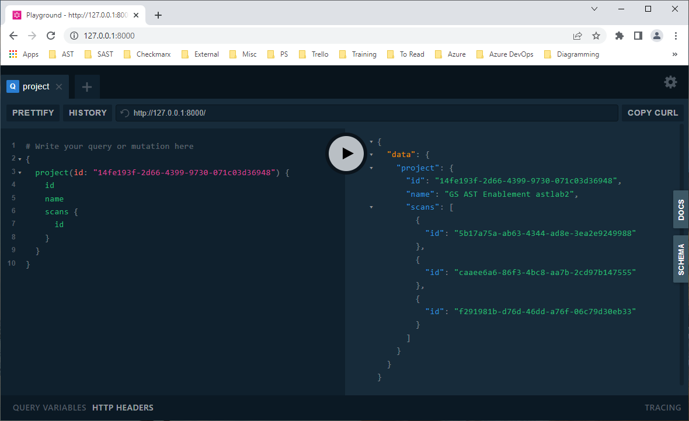

This is a proof of concept minimal GraphQL layer on top of the CxAST
REST API.

[Ariadne](https://ariadnegraphql.org/) is used to provide the GraphQL
functionality. The [Checkmarx Python
SDK](https://github.com/checkmarx-ts/checkmarx-python-sdk) is used to
access the CxAST REST API.

# GraphQL Schema

The following GraphQL schema is used:

```graphql
type Application {
  id: String!
  name: String!
  projects: [Project!]!
}

type Project {
  id: String!
  name: String!
  applications: [Application!]
  scans: [Scan!]
  groups: [String!]!
  repoUrl: String
  mainBranch: String
  origin: String!
  createdAt: String!
}

type Scan {
  id: String!
  createdAt: String!
  initiator: String!
  projectId: String!
  branch: String!
}

type Query {
  application(id: String!): Application
  applications: [Application!]!
  project(id: String!): Project
  projects: [Project!]!
  scan(id: String!): Scan
  scans: [Scan!]!
}

schema {
  query: Query
}
```

# Development

The [Poetry](https://https://python-poetry.org/) packaging and
dependency manager is used. After cloning the repository, a shell in a
virtual environment can be created with:

```
$ poetry shell
```

If using PowerShell on Windows, the following will lead to the newly
spawned shell being PowerShell.

```
C:\> py -3 ${ENV:USERPROFILE}\.poetry\bin\poetry shell
```

To start the server:

```
$ uvicorn ast-graphql:app
INFO:     Started server process [14100]
INFO:     Waiting for application startup.
INFO:     ASGI 'lifespan' protocol appears unsupported.
INFO:     Application startup complete.
INFO:     Uvicorn running on http://127.0.0.1:8000 (Press CTRL+C to quit)
```

# Sample Queries

Get the ids, names, and scan ids of all projects:

```
{
  projects {
    id
    name
    scans {
      id
    }
  }
}
```

Get the id, name and scan ids of a specific project:

```
{
  project(id: "14fe193f-2d66-4399-9730-071c03d36948") {
    id
    name
    scans {
      id
    }
  }
}
```

# Playground

Once running, a _playground_ is exposed on port 8000 of the local host:



The *Copy Curl* button (top left corner) copies the corresponding
**curl** command to the clipboard.

```
curl 'http://127.0.0.1:8000/' -H 'Accept-Encoding: gzip, deflate, br' -H 'Content-Type: application/json' -H 'Accept: application/json' -H 'Connection: keep-alive' -H 'DNT: 1' -H 'Origin: http://127.0.0.1:8000' --data-binary '{"query":"# Write your query or mutation here\n{\n  project(id: \"14fe193f-2d66-4399-9730-071c03d36948\") {\n    id\n    name\n    scans {\n      id\n    }\n  }\n}"}' --compressed
```
